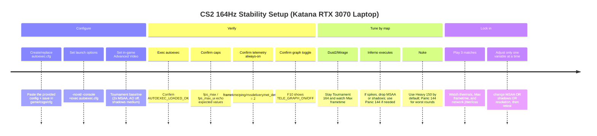

# CS2 164Hz Stability Guide for an MSI Katana RTX 3070 Laptop

## Executive summary

This report targets **stable, repeatable 164 FPS gameplay** (6.10 ms/frame) in entity["video_game","Counter-Strike 2","valve 2023"] on an entity["company","MSI","pc hardware maker"] Katana-class laptop (RTX 3070 Laptop GPU), with **Dust2/Mirage/Inferno prioritized** and **Nuke treated as “heavier”** with a dedicated cap. The approach is **frametime-first**: minimize spikes (stutter/micro-hitch) rather than merely maximizing average FPS.

Key conclusions (actionable):

- Your Katana variant’s RTX 3070 Laptop GPU is typically **85W max graphics power** with Dynamic Boost (not a full‑power 115–125W 3070). That materially raises the odds of GPU saturation and heat‑driven throttling if you chase uncapped FPS. citeturn12view0turn12view1  
- **164 FPS is a 6.10 ms frametime budget.** You can hold it consistently on lighter maps by reducing the biggest performance hogs (MSAA, Shadows, AO) and by capping FPS to avoid thermal oscillation; but “guarantee 164 in all cases” is unrealistic on laptops because power/thermal limits can force frequency drops. citeturn21search18turn19view0turn13search5  
- Use **three caps**:
  - **Tournament:** 164 (default for Dust2/Mirage/most Inferno)  
  - **Heavy map:** 150 (baseline for Nuke)  
  - **Panic:** 144 (when smokes/mollies + 10 players + firefights spike frametimes)  
- Use CS2’s **Telemetry HUD (always-on)** for FPS/frametime + ping + packet loss/misdelivery + jitter, and **avoid `cl_showfps`** (it produces the big red overlay many players dislike). Telemetry officially replaced older graphs (`cq_netgraph` was removed). citeturn4search0turn24view0turn15search8  
- Network “rate” is still relevant. Valve’s own release notes document **rate up to 786432** (6 Mbps “surge bandwidth”) and warn that too‑high burst demand can cause packet loss on weak hardware/ISPs. citeturn16search0  
- Prefer **NVIDIA Reflex = Enabled** (not “Enabled + Boost”) for this laptop stability goal: Boost can raise power draw and can slightly reduce frame rate. citeturn19view0  

## Hardware profile and laptop constraints

### Assumed platform (based on common Katana GF66 11UG/11UX configurations)

A typical Katana GF66 11UG variant pairs:
- **CPU:** 11th Gen Intel Core i7 (often i7‑11800H, 8C/16T, up to 4.6 GHz) citeturn12view1  
- **GPU:** GeForce RTX 3070 Laptop GPU (8GB GDDR6) at **~85W max graphics power** with Dynamic Boost (MSI spec sheet explicitly lists 85W for the 3070 option) citeturn12view0turn12view1  
- **Display:** commonly **15.6" 1080p 144Hz** internal panel (your 164Hz target likely implies an external 164/165Hz display, or a nonstandard panel—exact display resolution/Hz is unspecified) citeturn12view0turn12view1  
- **Cooling:** “Cooler Boost 5” dual-fan design (MSI marketing/spec language) citeturn12view1  

### Why laptop thermals matter more than settings folklore

On laptops, sustained FPS stability is often dictated by **power and cooling limits**, not by “magic” console commands:

- Intel documents that **power limit throttling** can occur for multiple reasons, including **insufficient cooling and power delivery**. When power/thermal limits trigger, clocks drop and frametimes spike—exactly what you feel as stutter. citeturn21search18  
- Two laptops with the *same GPU name* can perform very differently because **GPU power limits (TGP)** vary widely; this is specifically called out in laptop performance guidance. citeturn21search5turn12view0  

Practical implication for your goal: you get the best “stable 164” result by **capping FPS** and reducing the **spikiest render costs** (MSAA/Shadows/AO) so the system doesn’t bounce between boost and throttle states.

## Frametime math, bottlenecks, and why three presets work

### Frametime budgets

FPS is just the inverse of frametime:

- 164 FPS → **1000 / 164 = 6.10 ms** per frame  
- 150 FPS → **6.67 ms** per frame  
- 144 FPS → **6.94 ms** per frame  

That extra **0.84 ms** from 164 → 144 is often the difference between “holds smooth” and “micro-stutters” during utility-heavy executes (Inferno) or complex sightlines (Nuke).

### CPU-bound vs GPU-bound in CS2 terms

CS2 performance often becomes limited by “the slower side” each frame:
- If GPU frametime > CPU frametime → reduce GPU-heavy settings (MSAA, AO, resolution, some shadows).
- If CPU frametime > GPU frametime → reduce CPU-heavy settings (some shadow behaviors, particles/effects load, background tasks), and consider a slightly lower cap (150/144) so spikes don’t exceed the budget.

CS2’s workload characteristics and FPS stability issues are widely discussed in the community; Valve’s public bug trackers include reports about unusual CPU utilization behavior, illustrating that performance can hinge on CPU scheduling/usage patterns as well as pure GPU load. citeturn26search9  
Main takeaway: **lowering resolution alone may not “fix” dips** if you’re CPU-limited in those moments.

### Why “Preset + Panic” is not superstition

Valve/NVIDIA latency literature emphasizes that **consistent frame delivery** matters; wildly varying frame times degrade aim consistency even if the FPS counter looks okay. citeturn19view0  
So the goal of presets is to keep **telemetry “Max” frametime** from blowing past your frametime budget during known stress conditions.

## Recommended in-game settings for your maps and 164Hz target

These recommendations aim for **stable 164 FPS on Dust2/Mirage**, **good stability on Inferno**, and **acceptable performance on Nuke** (often via the 150/144 caps and slightly reduced image cost).

### Video settings

- **Display Mode:** Fullscreen (exclusive)  
- **Laptop power:** always play plugged-in (Katana ships with ~180W adapter in many configs) citeturn12view0turn12view1  

**Resolution options (choose based on telemetry):**
- **Primary (clarity-first):** 1920×1080 (native for most Katana panels) citeturn12view0turn12view1  
- **If Nuke or Inferno executes dip below 164 even with caps:**  
  - 1600×900 (16:9) as a mild reduction, or  
  - 1280×960 (4:3 stretched) if you need a bigger GPU headroom shift  
Use telemetry to verify whether the dips are GPU- or CPU-driven before committing (verification steps later).

### Advanced Video settings (Tournament baseline)

The most consistent competitive baseline on laptop hardware is “low cost but readable”:

- **Boost Player Contrast:** Enabled (common among pros; improves target separation) citeturn13search15turn13search0  
- **Wait for Vertical Sync (V-Sync):** Disabled for lowest latency (NVIDIA’s official Reflex guide explains V-Sync adds backpressure and latency; VRR has special cases, but baseline comp play is V-Sync off). citeturn19view0  
- **NVIDIA Reflex Low Latency:** **Enabled** (not Boost)  
  - “Enabled + Boost” can reduce latency further but costs extra power and can slightly lower FPS—on a laptop chasing stable FPS, that’s often the wrong trade. citeturn19view0  
- **MSAA:** **2x MSAA** (or **CMAA2** if you must maximize FPS)  
  - Community analysis of pro settings notes the biggest FPS drainers include **MSAA, Shadows, Ambient Occlusion**; on a laptop, keep MSAA modest unless you drop resolution heavily. citeturn13search5  
  - Many pros use 8x MSAA, but they typically run very low resolutions and/or top-tier rigs; don’t copy that blindly for a capped 164 laptop target. citeturn13search0turn13search15  
- **Global Shadow Quality:** Medium (start here; drop to Low if CPU-limited spikes persist)  
- **Dynamic Shadows:** All (competitive readability; common among pros) citeturn13search0turn13search6  
- **Model / Texture Detail:** Low or Medium (start Medium if you have VRAM headroom; drop if you see streaming hitch) citeturn13search0turn13search15  
- **Texture Filtering:** Bilinear (lowest consistent cost; widely used in pro configs) citeturn13search0turn13search15  
- **Shader Detail:** Low citeturn13search0turn13search15  
- **Particle Detail:** Low citeturn13search0turn13search15  
- **Ambient Occlusion:** Disabled (expensive; commonly disabled competitively) citeturn13search0turn13search5  
- **High Dynamic Range:** Performance (Quality is nicer but costs more; pros vary) citeturn13search0turn13search15  
- **FidelityFX Super Resolution:** Disabled (competitive clarity; pros often disable) citeturn13search0turn13search15  

### In-game Game/Telemetry/Network settings (important)

- **Telemetry section:** set **FPS/frametime, ping, network metrics to “Always”**. CS2 added a configurable performance diagnostic HUD (“Telemetry”) and removed older netgraph variants (`cq_netgraph`). citeturn4search0turn24view0  
- **Max Acceptable Matchmaking Ping:** pick a value you can consistently achieve (commonly 50–60 ms). This corresponds to `mm_dedicated_search_maxping`. citeturn0search8turn0search2  
- **Max Acceptable Game Traffic Bandwidth:** **Unrestricted** (equivalent to a high `rate` setting; see autoexec) citeturn16search0turn15search0  
- **Buffering to smooth over packet loss / jitter:** start at **None**, raise to **1 tick** or **2 ticks** only if telemetry shows persistent jitter/loss and you accept added latency. Valve patch notes explicitly pushed interpolation control into this setting (and blocked direct `cl_interp` edits). citeturn4search13turn18search11turn22search13  

## Autoexec, launch options, and keybind presets

### Launch options (minimal, high-signal)

Use only what is consistently useful:

```
-novid -console +exec autoexec.cfg
```

The “+exec autoexec.cfg” approach is widely used to guarantee your config loads at startup. citeturn20search10turn20search13  
Avoid cargo-cult options like `-high` and old `-threads` recipes unless you have a specific, tested reason; community consensus is that excessive launch-option tweaking is often placebo or outdated. citeturn20search1  

### Exact `autoexec.cfg` to paste

Save as: `...\Steam\steamapps\common\Counter-Strike Global Offensive\game\csgo\cfg\autoexec.cfg`

```cfg
// ============================================================================
// CS2 autoexec.cfg — MSI Katana (RTX 3070 Laptop) — 164Hz stability-focused
// Date: 2026-02-22
// Philosophy: frametime stability > peak FPS. No legacy CS:GO cmdrate/updaterate/bob.
// ============================================================================

echo "AUTOEXEC_LOADED_OK"

// --------------------
// FPS / pacing
// --------------------
fps_max_ui 120                 // cap menu FPS to reduce heat/noise
fps_max 164                    // default: Tournament cap (Dust2/Mirage/most Inferno)

// --------------------
// Low-latency pacing helpers
// --------------------
engine_low_latency_sleep_after_client_tick true

// --------------------
// Network
// --------------------
rate 786432                    // Valve-documented high "surge bandwidth" value
mm_dedicated_search_maxping 60 // tighten/loosen to taste (e.g. 50 for stricter)

// --------------------
// Telemetry HUD (ALWAYS ON: FPS/frametime + ping + loss + jitter numbers)
// --------------------
cl_showfps 0
cl_hud_telemetry_frametime_show 2
cl_hud_telemetry_ping_show 2
cl_hud_telemetry_net_misdelivery_show 2
cl_hud_telemetry_net_detailed 2

// --------------------
// Telemetry graphs (toggleable: jitter graph + server recv margin graph)
// --------------------
alias "tele_graph_on"  "cl_hud_telemetry_net_quality_graph_show 2; cl_hud_telemetry_serverrecvmargin_graph_show 2; alias tele_graph_toggle tele_graph_off; echo TELE_GRAPH_ON"
alias "tele_graph_off" "cl_hud_telemetry_net_quality_graph_show 0; cl_hud_telemetry_serverrecvmargin_graph_show 0; alias tele_graph_toggle tele_graph_on; echo TELE_GRAPH_OFF"
alias "tele_graph_toggle" "tele_graph_on"

// Default graphs OFF (numbers stay ON)
tele_graph_off

// --------------------
// Presets (map-based + panic)
// --------------------
// Tournament: stable 164 (Dust2/Mirage/Inferno baseline)
alias "cs_tournament" "fps_max 164; tele_graph_off; echo PRESET_TOURNAMENT_164"

// Heavy-map baseline: 150 cap (recommended for Nuke)
alias "cs_heavy"      "fps_max 150; tele_graph_off; echo PRESET_HEAVY_150"

// Panic: maximum stability 144 cap (executes, big utility fights)
alias "cs_panic"      "fps_max 144; tele_graph_off; echo PRESET_PANIC_144"

// Practice: uncapped (for aim maps/testing) + graphs ON
alias "cs_practice"   "fps_max 0; tele_graph_on;  echo PRESET_PRACTICE_UNCAPPED"

// --------------------
// Keybinds
// --------------------
bind "F6"  "cs_tournament"
bind "F7"  "cs_heavy"
bind "F8"  "cs_panic"
bind "F9"  "cs_practice"
bind "F10" "tele_graph_toggle"

// --------------------
// Optional (do NOT enable unless verified; see verification steps)
// --------------------
// r_low_latency 1

host_writeconfig
```

Why these exact lines are “safe” in modern CS2:

- Telemetry cvars and their 0/1/2 semantics are documented directly via CS2 console strings/UI mappings and config guides. citeturn24view0turn25view0  
- `cl_hud_telemetry_serverrecvmargin_graph_show` is the supported replacement mentioned when Valve removed `cq_netgraph`. citeturn4search0turn25view0  
- `fps_max_ui` is a real CS2 cvar (“Frame rate limiter while the game UI is displayed”). citeturn17search0turn17search11  
- `engine_low_latency_sleep_after_client_tick` is a real CS2 cvar tied to low latency mode behavior when `r_low_latency`/Reflex is enabled; treat it as a pacing behavior switch, not a magic FPS booster. citeturn0search10turn0search1  
- `rate 786432` and the “surge bandwidth may cause packet loss on weak networks” warning are documented by Valve. citeturn16search0  
- `mm_dedicated_search_maxping` is the supported way to constrain matchmaking server ping (region locking is not directly exposed as a single hard “region” setting). citeturn0search8turn0search2  

### Preset comparison table (exact cvars + in-game toggles)

| Preset | Goal | Autoexec actions (exact) | In-game Video/Advanced actions | When to use |
|---|---|---|---|---|
| Tournament (stable 164) | Hold the 6.10 ms budget on Dust2/Mirage and most Inferno rounds | `fps_max 164` + telemetry numbers always + graphs off | 1080p; MSAA 2x; Shadows Medium; Dynamic Shadows All; AO Off; Shaders/Particles Low; HDR Performance; Reflex Enabled; V-Sync Off citeturn19view0turn13search5turn13search0 | Default for your main maps |
| Practice (uncapped responsiveness) | Max responsiveness/aim training; observe graphs | `fps_max 0` + graphs on (`tele_graph_on`) | Keep the same visuals (don’t test aim with different visuals); Reflex Enabled; V-Sync Off citeturn19view0turn25view0 | Aim maps, DM warmup, diagnostics |
| Panic (max stability 144) | Survive worst-case spikes (6.94 ms budget) | `fps_max 144` + graphs off | If still unstable: lower MSAA to CMAA2/off; Shadows Low; consider 1600×900 or 1280×960 citeturn13search5turn19view0 | Inferno executes, Nuke chaos, thermal throttling onset |

Notes:
- The **“Heavy 150”** mode (F7) is intentionally between 164 and 144; it gives you meaningful headroom without feeling dramatically different on a 164Hz display.
- Keep Reflex on “Enabled” by default; prefer not to use Boost on a stability-first laptop target. citeturn19view0  

## Testing, verification, and troubleshooting

### Verification commands (what to run, what you should see)

1) **Load autoexec**
- Console:
  - `exec autoexec`
- Expected:
  - `AUTOEXEC_LOADED_OK`

2) **Confirm core caps**
- Console:
  - `fps_max`
  - `fps_max_ui`
- Expected:
  - `fps_max = 164` (unless you switched preset)
  - `fps_max_ui = 120` citeturn17search0turn17search11  

3) **Confirm telemetry always-on**
- Console:
  - `cl_hud_telemetry_frametime_show`
  - `cl_hud_telemetry_ping_show`
  - `cl_hud_telemetry_net_misdelivery_show`
  - `cl_hud_telemetry_net_detailed`
- Expected:
  - Each echoes `= 2` (Always). citeturn24view0turn25view0  

4) **Confirm the graphs toggle**
- Press **F10**:
  - First press should echo `TELE_GRAPH_ON`
  - Second press should echo `TELE_GRAPH_OFF`
- Confirm commands exist:
  - `cl_hud_telemetry_net_quality_graph_show`
  - `cl_hud_telemetry_serverrecvmargin_graph_show` citeturn25view0turn4search0  

5) **Network sanity**
- Console:
  - `rate`
  - `mm_dedicated_search_maxping`
- Expected:
  - `rate = 786432`
  - `mm_dedicated_search_maxping = 60` citeturn16search0turn0search8  

6) **Reflex / r_low_latency availability check (do not assume)**
- Console:
  - `find r_low_latency`
- If `r_low_latency` appears but doesn’t echo normally, it may be flagged devonly/defensive in some builds; prefer setting Reflex via the in-game menu. citeturn9search9turn19view0  

### How to test “stable 164” on your maps

Use the Telemetry frametime line (Max/Avg) and interpret it against your budgets:

- **Tournament 164:** you want sustained Max frametime rarely exceeding ~6–7 ms in normal play; occasional spikes happen, but repeated >8–10 ms indicates instability.  
- If Dust2/Mirage are stable but Inferno spikes:
  - keep Tournament preset but reduce MSAA (2x → CMAA2) first (GPU-heavy), then reduce shadows (CPU/GPU). citeturn13search5  
- If Nuke repeatedly spikes in fights:
  - switch to **Heavy 150** (F7) as your default Nuke cap; reserve Panic 144 (F8) for the worst rounds.

### Troubleshooting

**Unknown command spam after `exec autoexec`**
- Cause: old CS:GO-era lines in your autoexec (common offenders: `cl_cmdrate`, `cl_updaterate`, `m_rawinput`, legacy `cl_bob_*`). Valve/community discussions note several were removed/deprecated in CS2 builds. citeturn14search0turn14search4  
- Fix: delete unknown lines; keep only verified CS2 cvars. Prefer the verification method above: if it echoes a value, it exists.

**Big red FPS text (like “154 fps on maps/de_inferno…”)**
- Cause: `cl_showfps` overlay mode (popular guides tell people to use it; it’s noisy and ugly). citeturn15search8turn15search2  
- Fix:
  - `cl_showfps 0` (already enforced in the provided autoexec).

**“Server region” setting**
- CS2 doesn’t provide a clean hard “region lock” knob in the way players expect; align via **max ping constraint**:
  - `mm_dedicated_search_maxping 50–70` depending on your region/queue times. citeturn0search8turn0search2  

**Packet loss/jitter feels bad but telemetry looks okay**
- Valve updated Telemetry’s network-quality measurement to focus on *gameplay impact* (ticks missed due to loss/jitter) and also added the **detailed network quality display** for raw packet loss and jitter numbers—so make sure you’re using the detailed mode (`cl_hud_telemetry_net_detailed 2`), not just the headline metric. citeturn22search13turn24view0turn25view0  
- If telemetry shows consistent jitter/loss and you can tolerate extra latency, increase “Buffering to smooth over packet loss / jitter” to 1–2. Valve notes this smooths problems but adds latency; patch notes also indicate interpolation is controlled there rather than via `cl_interp`. citeturn18search11turn4search13  

### Implementation and test timeline (Mermaid)



### Crosshair and HUD note

Your crosshair code should be imported via the in-game crosshair share/import UI (most reliable across CS2 builds):

- `CSGO-WktFi-v7edr-Dc42P-MiOdp-VYq3B`

Your telemetry/HUD requirements (ping + packet loss + jitter + FPS always visible) are already satisfied by:

- `cl_hud_telemetry_frametime_show 2`
- `cl_hud_telemetry_ping_show 2`
- `cl_hud_telemetry_net_misdelivery_show 2`
- `cl_hud_telemetry_net_detailed 2` citeturn24view0turn25view0